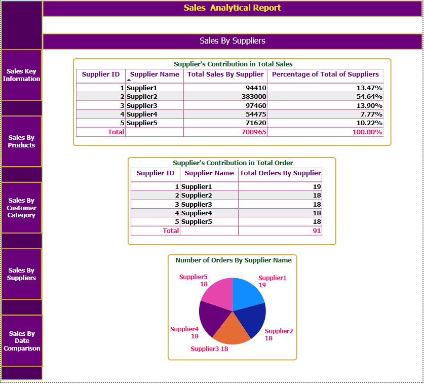
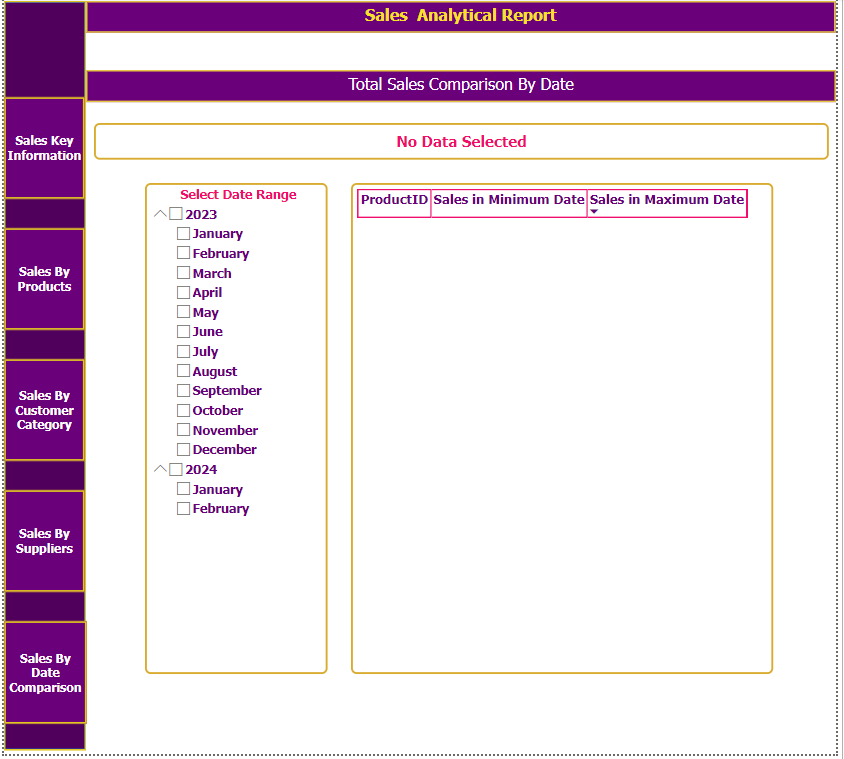

# Power BI Sales Analysis Project

## Project Overview

This Power BI project showcases a comprehensive sales analysis using Power BI. The goal was to analyze sales data to gain 
insights into different aspects of the business, such as product performance, customer demographics, and sales trends over time.
This analysis helps the business identify trends, optimize product strategies, and understand customer demographics. 

## Key Features

- **Interactive / One single-page layout Navigation**: The dashboard is designed with a single-page layout featuring buttons for
 seamless navigation between different sections. This makes the user experience more intuitive and engaging.

## Skills Demonstrated

- **Interactive / One page-layout Navigation**: Creating a single-page dashboard with interactive buttons for seamless navigation.
- **Calculated Table**: Using Calculated Table for complex calculations.
- **DAX Functions**: Using DAX for complex calculations and measures.

- **Filter Context and Row Context**: Understanding and applying filter and row context in DAX.
- **Time Intelligence**: Implementing time-based calculations and analyses.
- **Data Modeling**: Designing relationships between tables.
- **Data Visualization**: Creating effective and interactive visualizations.

## Key Insights

- **Total Sales Over Different Time Periods**: Monthly, Quarterly, Yearly Sales.
- **Percentage of Total Sales by Product Category**.
- **Average Order Value by Customer Age Group**.
- **Total Sales by Customer Age Group**.
- **Product Performance Analysis**.
- **Top 10 Customers by Total Sales**.
- **Sales Growth Over Time**.
- **Total Sales for Each Product Category Within a Selected Date Range**.
- **Count of Customers Per Category**.
- **Average Monthly Sales**.
- **Total Sales for Electronics**.
- **Total Sales by State**.

## Data Used
#### Calculated Tables

In addition to the core / Primary data tables, the project includes the following Calculated Tables to support specific analyses:

- **DateTable**: A generated date table for time-based analysis.
- **Product_Performance**: Analyzes product performance metrics.
- **Top_10_Customers_By_Sales**: Displays the top 10 customers based on total sales, allowing for quick identification of key customers.
- **Total_Sales_By_ProductCategory**: Summarizes total sales for each product category, used for category-level analysis in the dashboard.

#### Primary Tables

The dataset includes the following Primary tables:

- **Customer**: Contains customer demographic information.
- **Orders**: Contains order details, including order date, product ID, and total amount.
- **Products**: Contains product details.
- **Supplier**: Contains supplier details.

## Screenshots of entire project

### 1. Sales Key Information Screen

This section provides a quick overview of critical sales metrics, including monthly, quarterly, and yearly sales, as well as customer retention rate
and order summary.

### 2. Sales By Products Analysis Screen

The "Sales By Products Analysis" screen provides a detailed look at product performance. Key insights include:
- **Total Sales by Product Category**: Summarizes total sales for each category.
- **Percentage of Product Category**: Shows the proportion of each category's contribution to overall sales.
- **Product Performance**: A table with product-specific data, including average price, total quantity sold, and total sales.

### 3. Sales By Customer Category

The "Sales By Customer Category" screen analyzes customer segments based on their order behavior. Key insights include:
- **Total Order and Count Per Customer Category**: Summarizes the total orders and number of customers within each category (High, Medium, Low).
- **Average Order Value by Customer Category**: Shows the average order value for each customer category, highlighting the high-value customers.

### 4. Sales By Suppliers

The "Sales By Suppliers" screen provides an analysis of each supplier's contribution to the company's total sales and order count. Key insights include:
- **Supplier Contribution in Total Sales**: A table that shows the total sales and percentage contribution of each supplier, helping to identify 
    top-performing suppliers.
- **Total Orders by Supplier**: Summarizes the total number of orders from each supplier.
- **Number of Orders by Supplier (Pie Chart)**: A visual representation of order distribution across suppliers.

### 5. Total Sales Comparison By Date

The "Total Sales Comparison By Date" screen enables date-based comparisons to analyze sales over selected periods. Key features include:
- **Date Range Selection**: Users can choose specific months and years to define a range for comparison.
- **Sales Comparison Table**: Displays sales by product between the minimum and maximum selected dates, allowing users to see sales trends over time.

## Visualizations

- **Sales Trend Charts**: Used to track revenue changes over time, highlighting seasonal trends or periods of growth
- **Category Contribution Pie Charts**: Visualize the contribution of each product category to the total sale.
- **Bar Charts**: Analyzing sales by customer age group, product performance, and top customers.
- **Line Charts**: Showing sales growth over time.

## How to Run the Project

1. Download the project files from this repository.
2. Open the Power BI file (`.pbix`) in Power BI Desktop.
3. Ensure the data connections are updated to the correct file paths for the data sources.
4. Explore the dashboard and interact with the slicers and buttons to view the analysis.

## About Me

Education:

    1. Microsoft Certified Solution Developer (MCSD) - Microsoft, USA*
    - Certified in Visual Basic, SQL Server, and Software Architecture 

    2. Bachelor of Business - Victoria University Melbourne – Australia.    
        • Year - 2019 • Result – GPA 5.9/7 (Average Distinctions (73%))  
	Achieved High Distinction (HD) in 6 units, including Supply Chain Analytics (Score: 90/100) , Database Systems (Score: 88/100)
                                                   and  Operations Management (Score: 89/100)
    3. Advanced Diploma in Information Technology (Software Development) (2 Years), NIIT – India.
    4. Graduate Diploma of Enterprise Resource Planning System (SAP-ERP) (Half Completed)
        Victoria University – Australia.

    5. Google Data Analytics Professional Certificate
    6. Google IT Support Professional Certificate
    7. Power BI Data Analytics for All Levels (From CodeBasics.io)
    8. Microsoft Power BI : Complete Guide ( Udemy.com)
    9. SQL Mastery certificate (from Code with Mosh)
    10.SQL Beginner to Advanced Professional Certificate (From Code Basics (https://codebasics.io)

   My journey into data began with 5+ years of experience as a Database Programmer, where I worked extensively with Seagate Crystal Reports,
developing reports and performing analysis. This foundational experience equipped me with a solid understanding of database management and reporting.

I achieved the Microsoft Certified Solution Developer (MCSD) certification, specializing in Visual Basic, SQL Server, and Software Architecture to further 
enhance my technical expertise. This certification showcases my in-depth knowledge of database systems and architecture, allowing me to develop robust
and effective solutions.

During my 2-year Advanced Diploma in Information Technology (Software Development) at NIIT-India, I worked on a large database software project as part of
my studies. Through this project, I gained experience with various types of reports and analysis.

After that, I myself, independently developed a complete 'One-point Sales' software for a BATA Shoe branch using Visual Basic, SQL/MS Access, and Crystal
Report. I created the entire software package on my own and successfully sold it to the owner. This individual project provided me with extensive real-life 
experience in reporting and analysis
  

Additionally, I enhanced my analytical skills by achieving a High Distinction (HD) with 90/100 marks in the Supply Chain Analytics unit as part of my 
Bachelor of Business degree at Victoria University, Australia. This provided me with a strong grounding in statistical analysis and supply chain
optimization.

More recently, I have gained hands-on experience with Power BI, DAX functions, and data visualization through some exciting real-life projects, including 
the one presented here.

Although I haven’t worked professionally as a Data Analyst at a company yet, but I have developed relevant skills through relevant certificate course,
studies and developing these real-life Power BI projects. These experiences have prepared me to contribute meaningfully in an entry-level Power BI role.

Moreover, I received a testimonial from my university lecturer in recognition of my excellence in Database Systems, achieving a High Distinction (HD) 
with a mark of 88/100 during my Bachelor of Business degree. This testimonial highlights my strong understanding of SQL, data normalization, and database
design, as well as my commitment to academic excellence.

## Contact

Looking forward to connecting and exploring data-driven insights together!

Please feel free to reach out to me on LinkedIn (https://www.linkedin.com/in/prince30307070) for any questions or collaboration opportunities.

Also, Feel free to contact me via Email ::  Prince10103030@gmail.com

   Thank you for reviewing my work. I look forward to discussing potential collaboration opportunities.
                    I am truly grateful for this opportunity—take care!

