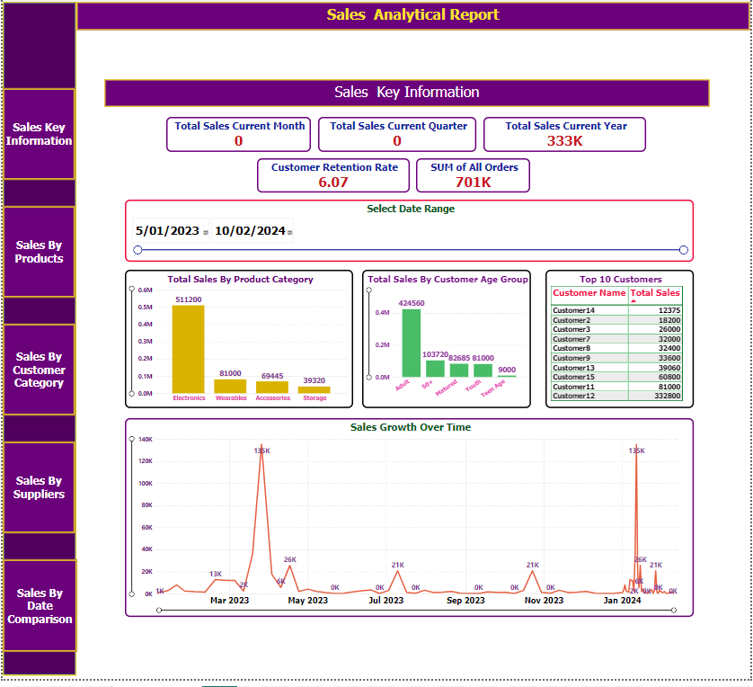
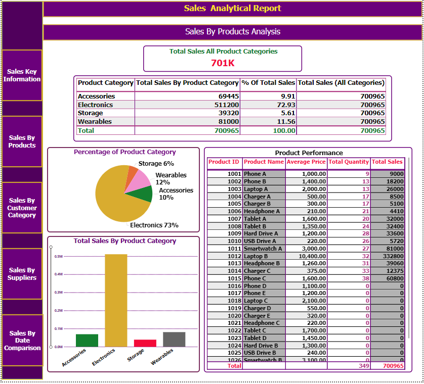
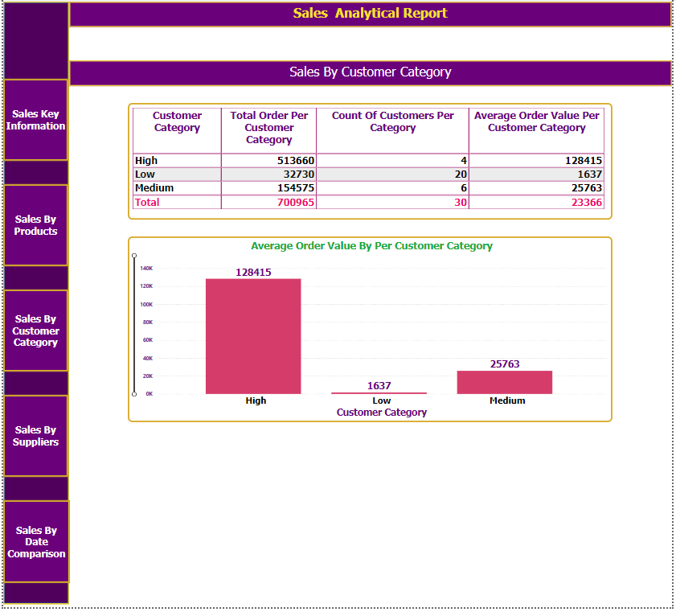

# Power BI Sales Analysis Project

## Project Overview

This Power BI project showcases a sales analysis using Power BI. The goal was to analyze sales data to gain insights into different aspects of the business, such as product performance, customer demographics, and sales trends over time. This analysis helps the business identify trends, optimize product strategies, and understand customer demographics.

## Key Features

- **Interactive Single-Page Layout**: The dashboard features interactive buttons for seamless navigation between different sections, making the user experience intuitive and engaging.

## Skills Demonstrated

- **Interactive Dashboard**: Designed a single-page dashboard with buttons for easy navigation.
- **DAX Functions**: Applied DAX for calculations and measures.
- **Data Modeling**: Established relationships between tables for effective analysis.
- **Data Visualization**: Created effective visualizations to communicate insights.

## Key Insights

- **Total Sales Over Different Time Periods**: Monthly, Quarterly, Yearly Sales.
- **Percentage of Total Sales by Product Category**.
- **Average Order Value by Customer Age Group**.
- **Product Performance Analysis**.
- **Top 10 Customers by Total Sales**.

## Data Used

#### Calculated Tables

- **DateTable**: Generated date table for time-based analysis.
- **Product_Performance**: Analyzes product performance metrics.

#### Primary Tables

- **Customer**: Contains customer demographic information.
- **Orders**: Contains order details, including order date, product ID, and total amount.
- **Products**: Contains product details.

## Screenshots of the Project

### 1. Sales Key Information Screen
Provides an overview of key sales metrics, including monthly, quarterly, and yearly sales.

### 2. Sales By Products Analysis Screen
Details product performance, including:
- **Total Sales by Product Category**.
- **Product Performance**: Data such as average price, total quantity sold, and total sales.

### 3. Sales By Customer Category
Analyzes customer segments based on order behavior.

## Visualizations

- **Sales Trend Charts**: Track revenue changes over time.
- **Category Contribution Pie Charts**: Visualize product category contributions to total sales.
- **Bar Charts**: Analyze sales by customer age group and top customers.

## How to Run the Project

1. Download the project files from this repository.
2. Open the Power BI file (`.pbix`) in Power BI Desktop.
3. Update data connections to the correct file paths for the data sources.
4. Explore the dashboard using slicers and buttons.

## About Me

**Education:**

1. **Bachelor of Business - Victoria University - Melbourne – Australia.

        • Year - DECEMBER-2018 • Result – GPA 5.9/7 (Average Distinctions (73%))
   
	       Achieved High Distinction (HD) in 6 units, including 

	Database Systems (Score: 88/100) (Highest Mark) (Got Testimonial from University Lecturer)
        Supply Chain Analytics (Score: 90/100) (Highest Mark) ,
        Operations Management (Score: 89/100) (Highest Mark)

3. **Information Technology Advanced Diploma (Software Development) - NIIT, India**
   - Completed a 2-year program with a focus on database development and software solutions.

4. **Data Analytics Professional Certificate by Google**
5. **IT Support Professional Certificate by Google**
6. **Power BI Data Analytics for All Levels (CodeBasics.io)**
7. **Power BI: Complete Guide (Udemy.com)**
8. **SQL Mastery Certificate (Code with Mosh)**
9. **SQL Beginner to Advanced Certificate (CodeBasics.io)**

**Work Experience:**

- **Junior Database Programmer (Softweb Bangladesh)**
  - Duration: 1 year (2005 January - 2006 January)
  - Assisted in managing database systems, software, and business reports to support data-driven decision-making.
  - **User Interface Design**: Assisted in developing forms using Visual Basic.
  - **Relational Database Systems**: Assisted in managing databases with SQL Server and MS Access for data management.
  - **Reports Generation**: Supported in generating business reports using Seagate Crystal Reports.
  - **Coding and Debugging**: Assisted in writing and debugging Visual Basic code.
  - **Quality Assurance**: Assisted in quality checks to ensure reliability.

My journey into data analysis has been driven by a passion for working with data and creating meaningful insights. 
I recently developed hands-on skills with Power BI, DAX functions, and data visualization through real-life projects,
including the sales analysis presented here. I am eager to apply these skills in an entry-level IT role and continue 
my learning journey in the industry.

## Contact

Looking forward to connecting and exploring data-driven insights together!

Please feel free to reach out to me on LinkedIn: [LinkedIn Profile](https://www.linkedin.com/in/prince30307070)

You can also contact me via email: Prince10103030@gmail.com

Thank you for reviewing my work. I look forward to potential collaboration opportunities!

